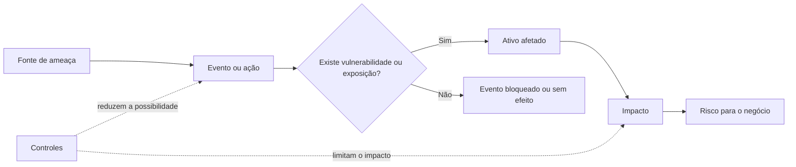
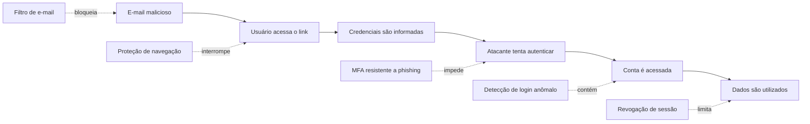
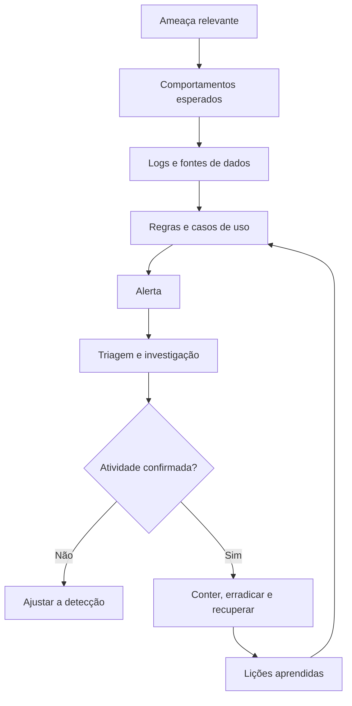

#  Capítulo 004 — Ameaças

> **Entender antes de decorar.**

---

| Informação | Detalhes |
|---|---|
| **Módulo** | 01 — Fundamentos |
| **Nível** | Iniciante |
| **Tempo estimado** | 15 a 20 minutos |
| **Pré-requisito** | [Capítulo 003 — Princípio do Menor Privilégio](003-principio-do-menor-privilegio.md) |

---

##  Objetivo deste capítulo

Ao final deste capítulo, você será capaz de:

- explicar o que é uma **ameaça** em Segurança da Informação;
- diferenciar ameaça, vulnerabilidade, ataque, incidente, impacto e risco;
- reconhecer ameaças adversariais, acidentais, estruturais e ambientais;
- entender por que uma ameaça não precisa ser intencional nem vir de fora da organização;
- relacionar ameaças à **Tríade CIA**;
- compreender como SOCs e equipes de Cyber Threat Intelligence analisam ameaças.

---

## Como sempre, vamos começar utilizando nossa imaginação.

Imagine uma empresa que armazena informações de milhares de clientes.

Diferentes situações podem causar danos aos dados e aos sistemas dessa organização:

- um criminoso pode roubar credenciais por meio de phishing;
- um ransomware pode criptografar arquivos;
- um funcionário pode excluir informações por engano;
- um servidor pode apresentar falha;
- uma queda de energia pode interromper a operação;
- um incêndio pode atingir o ambiente físico;
- um fornecedor comprometido pode afetar seus clientes.

Esses acontecimentos são diferentes, mas possuem algo em comum:

> **Todos têm potencial para comprometer a Confidencialidade, a Integridade ou a Disponibilidade.**

Em Segurança da Informação, chamamos essas possibilidades de **ameaças**.

Nos capítulos anteriores, aprendemos o que precisa ser protegido e como o Princípio do Menor Privilégio pode limitar o impacto de acessos indevidos.

Agora precisamos responder:

> **O que pode causar dano ao que estamos tentando proteger?**

---

# O que é uma ameaça?

Uma **ameaça** é qualquer circunstância ou evento com potencial para causar impacto negativo a uma organização, aos seus ativos, às suas operações ou às pessoas.

Esse impacto pode ocorrer por meio de:

- acesso não autorizado;
- exposição de informações;
- alteração ou destruição de dados;
- interrupção de sistemas;
- fraude;
- sabotagem;
- abuso de recursos;
- perda física de equipamentos.

Em outras palavras:

> **A ameaça representa algo que pode dar errado e causar dano.**

 "Potencial não significa incidente confirmado"
    Uma ameaça pode existir mesmo que nenhum ataque tenha acontecido.

    A possibilidade de phishing, falha técnica, erro humano ou evento ambiental já exige análise e preparação.

---

## Ameaça não é sinônimo de hacker

Um invasor pode ser uma fonte de ameaça, mas ameaças não precisam ser pessoas nem possuir intenção maliciosa.

| Situação | Existe intenção maliciosa? | Pode causar dano? |
|---|:---:|:---:|
| Criminoso tenta roubar credenciais | Sim | Sim |
| Funcionário apaga um arquivo por engano | Não | Sim |
| Disco de um servidor apresenta falha | Não | Sim |
| Tempestade interrompe a energia | Não | Sim |
| Prestador abusa de um acesso legítimo | Sim | Sim |

Proteger uma organização, portanto, exige uma visão mais ampla do que apenas impedir invasões pela internet.

---

# Conceitos que não devem ser confundidos

Ameaças aparecem junto de vários termos relacionados. Entender a diferença entre eles é fundamental.

| Conceito | Pergunta principal | Exemplo |
|---|---|---|
| **Ativo** | O que queremos proteger? | Banco de dados de clientes |
| **Ameaça** | O que pode causar dano? | Roubo ou indisponibilidade dos dados |
| **Fonte de ameaça** | De onde o perigo pode surgir? | Criminoso, erro humano, falha técnica ou enchente |
| **Vulnerabilidade** | Qual fraqueza pode ser explorada? | Sistema desatualizado ou senha fraca |
| **Vetor de ataque** | Por qual caminho o ataque pode chegar? | E-mail, serviço exposto ou fornecedor |
| **Ataque** | Qual ação intencional foi realizada? | Envio de phishing e uso da senha roubada |
| **Incidente** | O que afetou ou ameaçou a segurança? | Conta comprometida e utilizada pelo invasor |
| **Impacto** | Qual foi a consequência? | Vazamento ou paralisação |
| **Risco** | Qual é a possibilidade e a gravidade? | Possibilidade de perda financeira e operacional |
| **Controle** | O que reduz a possibilidade ou o impacto? | MFA, backups, EDR e segmentação |

 "Ameaça e vulnerabilidade são diferentes"
    A ameaça representa o potencial de dano.

    A vulnerabilidade é uma fraqueza que pode facilitar esse dano.

    Uma senha fraca é uma **vulnerabilidade**. Um criminoso tentando descobri-la é uma **fonte de ameaça**. O uso da senha para entrar no sistema é uma **ação de ataque**.

---

## Como esses conceitos se relacionam?



A existência de uma ameaça não garante que o dano ocorrerá.

O resultado depende de fatores como:

- exposição do ativo;
- existência de vulnerabilidades;
- capacidade da fonte de ameaça;
- eficácia dos controles;
- velocidade de detecção e resposta;
- impacto para o negócio.

---

# Fonte, evento e cenário de ameaça

## Fonte de ameaça

É a origem potencial do dano.

Pode ser:

- uma pessoa ou grupo;
- um erro humano;
- uma falha técnica;
- um fornecedor;
- um evento natural;
- uma condição ambiental.

## Evento de ameaça

É uma situação capaz de causar uma consequência indesejada.

Exemplos:

- tentativa de exploração de um servidor;
- uso de credenciais roubadas;
- exclusão acidental de uma pasta;
- falha em um dispositivo de armazenamento;
- interrupção no fornecimento de energia.

## Cenário de ameaça

É uma sequência que mostra como o dano pode acontecer.

```text
Criminoso envia phishing
        ↓
Usuário informa a senha
        ↓
Atacante acessa a conta
        ↓
Documentos são coletados
        ↓
Ocorre fraude ou vazamento
```

Analisar cenários ajuda a identificar pontos em que a organização pode prevenir, detectar ou interromper o problema.

---

# Categorias de fontes de ameaça

Uma forma útil de organizar as ameaças é separá-las em quatro categorias:

1. adversariais;
2. acidentais;
3. estruturais;
4. ambientais.

---

## 1. Ameaças adversariais

São associadas a ações intencionais.

O agente pode buscar:

- ganho financeiro;
- roubo de informações;
- espionagem;
- interrupção de serviços;
- fraude;
- sabotagem;
- vantagem competitiva;
- promoção de uma causa.

### Exemplos

- phishing;
- ransomware;
- roubo de credenciais;
- exploração de vulnerabilidades;
- ataques de negação de serviço;
- fraude;
- abuso de privilégios;
- comprometimento de fornecedores.

### Controles relacionados

- MFA;
- correção de vulnerabilidades;
- segmentação de rede;
- EDR;
- WAF e IPS;
- filtragem de e-mail;
- menor privilégio;
- backups protegidos;
- monitoramento e resposta a incidentes.

---

## 2. Ameaças acidentais

São situações sem intenção de causar dano, normalmente ligadas a erro humano.

### Exemplos

- envio de e-mail para a pessoa errada;
- exclusão acidental de arquivos;
- configuração incorreta;
- perda de equipamento;
- execução de comando no ambiente errado;
- publicação involuntária de informações.

### Controles relacionados

- treinamento;
- revisão de mudanças;
- segregação de funções;
- menor privilégio;
- backups;
- versionamento;
- procedimentos documentados;
- separação entre testes e produção.

 "Calma lá.. nem todo erro é apenas culpa do usuário"
    Também precisamos avaliar se os processos, as permissões e os controles permitiram que uma única ação causasse um impacto excessivo.

---

## 3. Ameaças estruturais

São relacionadas a falhas em equipamentos, softwares ou serviços.

### Exemplos

- falha de disco;
- defeito em equipamento de rede;
- erro de software;
- corrupção de banco de dados;
- indisponibilidade de um provedor;
- interrupção de link;
- falha de climatização.

### Controles relacionados

- redundância;
- alta disponibilidade;
- monitoramento;
- manutenção preventiva;
- gestão de capacidade;
- testes de restauração;
- planos de continuidade e recuperação.

---

## 4. Ameaças ambientais

São associadas ao ambiente físico ou a eventos naturais.

### Exemplos

- incêndio;
- enchente;
- tempestade;
- raio;
- calor excessivo;
- queda prolongada de energia;
- vazamento de água.

### Controles relacionados

- sensores de fumaça e temperatura;
- combate a incêndio;
- energia alternativa;
- redundância geográfica;
- backups fora do local principal;
- plano de continuidade;
- plano de recuperação de desastres.

---

# Agentes de ameaça

Nas ameaças intencionais, a fonte pode ser chamada de **agente de ameaça** ou **ator de ameaça**.

| Agente | Motivação comum | Exemplos de atividade |
|---|---|---|
| **Cibercriminoso** | Ganho financeiro | Fraude, extorsão e ransomware |
| **Grupo patrocinado por Estado** | Espionagem ou interesse estratégico | Campanhas persistentes e direcionadas |
| **Hacktivista** | Causa política ou social | Vazamentos, desfiguração e DDoS |
| **Insider malicioso** | Vingança, fraude ou benefício próprio | Roubo de dados e sabotagem |
| **Atacante oportunista** | Ganho rápido ou curiosidade | Exploração de alvos expostos |

Ao analisar um agente, algumas perguntas ajudam:

- qual é sua motivação?
- o que pretende alcançar?
- quais recursos e conhecimentos possui?
- existe uma oportunidade viável para atingir a organização?

Uma ameaça pode ser relevante para um setor e pouco provável para outro. Por isso, informações sobre agentes precisam ser relacionadas ao contexto da organização.

---

# Ameaça interna

Uma ameaça não precisa vir de fora.

## Insider malicioso

Age intencionalmente para roubar informações, cometer fraude, sabotar sistemas ou favorecer terceiros.

## Insider negligente

Não pretende causar dano, mas pode:

- compartilhar senhas;
- enviar dados à pessoa errada;
- ignorar procedimentos;
- utilizar armazenamento não autorizado;
- cair em phishing.

## Conta interna comprometida

A identidade pertence a um usuário legítimo, mas está sendo controlada por um invasor.

Esse cenário pode ser difícil de identificar porque a atividade parte de uma conta válida.

 "Observe o comportamento, não apenas a origem"
    Uma conexão interna ou uma conta válida não deve ser considerada automaticamente segura.

---

# Vetor, técnica e carga maliciosa

## Vetor de ataque

É o caminho usado para alcançar o alvo.

Exemplos: e-mail, aplicação web, serviço remoto, credencial vazada, fornecedor, dispositivo USB ou acesso físico.

## Técnica

É a maneira como o atacante realiza uma ação.

Exemplos: phishing, força bruta, exploração de serviço, abuso de conta válida ou criação de tarefa agendada.

## Carga maliciosa

É o código ou componente utilizado para produzir uma ação.

Exemplos: trojan, infostealer, ransomware, web shell ou script malicioso.

### Exemplo completo

```text
Fonte: grupo criminoso
Vetor: e-mail
Técnica: phishing
Carga maliciosa: infostealer
Evento: credenciais são coletadas
Impacto: acesso indevido e possível vazamento
```

---

# Ameaça não é sinônimo de ataque

A ameaça representa o **potencial de dano**.

O ataque representa uma **ação intencional** contra um alvo.

Exemplo com ransomware:

1. a possibilidade de a empresa ser atingida representa uma ameaça;
2. o grupo criminoso é uma fonte de ameaça;
3. o phishing pode ser o vetor inicial;
4. a execução do malware faz parte do ataque;
5. a criptografia dos arquivos é um evento de ameaça;
6. a paralisação da operação é o impacto;
7. a possibilidade e a gravidade contribuem para o risco.

---

# Ameaças e a Tríade CIA

| Ameaça ou evento | Confidencialidade | Integridade | Disponibilidade |
|---|:---:|:---:|:---:|
| Vazamento de dados | ✅ |  |  |
| Alteração de registros |  | ✅ |  |
| DDoS |  |  | ✅ |
| Exclusão acidental |  | ✅ | ✅ |
| Ransomware com exfiltração | ✅ | ✅ | ✅ |
| Conta administrativa comprometida | ✅ | ✅ | ✅ |
| Falha de hardware |  | Possível | ✅ |

Uma mesma ameaça pode afetar vários pilares ao mesmo tempo.

Um ransomware, por exemplo, pode copiar dados, alterar arquivos e impedir que os sistemas sejam utilizados.

---

# Cenário prático — Phishing e roubo de credenciais

Um colaborador recebe um e-mail informando que sua senha expirará em poucas horas.

A mensagem direciona para uma página falsa. O usuário informa suas credenciais e o atacante passa a utilizar a conta.

| Elemento | Exemplo |
|---|---|
| **Ativo** | Conta corporativa, e-mails e documentos |
| **Fonte de ameaça** | Cibercriminoso |
| **Vetor** | E-mail |
| **Técnica** | Phishing para coleta de credenciais |
| **Vulnerabilidades ou exposições** | Ausência de MFA, filtragem insuficiente ou baixa conscientização |
| **Evento** | Uso das credenciais obtidas |
| **Impacto** | Acesso a dados, fraude e envio de novos phishing |
| **Controles** | MFA resistente a phishing, filtros, treinamento e monitoramento de identidade |

## Pontos de interrupção



Esse cenário mostra que a defesa não depende de um único controle. Existem oportunidades para prevenir, detectar e conter o ataque em diferentes momentos.

---

# Outro exemplo — DDoS

Uma loja virtual começa a receber uma quantidade muito superior ao normal de requisições e fica indisponível.

| Elemento | Exemplo |
|---|---|
| **Ativo** | Loja virtual |
| **Fonte de ameaça** | Grupo criminoso, hacktivista ou serviço de ataque contratado |
| **Evento** | Sobrecarga de conexões e recursos |
| **Impacto** | Indisponibilidade, perda de vendas e dano reputacional |
| **Controles** | CDN, anti-DDoS, rate limiting, filtragem e plano de resposta |

Nesse caso, o pilar principalmente afetado é a **Disponibilidade**.

---

# Como um SOC observa ameaças

Uma ameaça é uma possibilidade. Para monitorá-la, o SOC procura comportamentos e evidências observáveis.

| Cenário | Possíveis sinais |
|---|---|
| Roubo de credenciais | Login incomum, falhas repetidas e dispositivo desconhecido |
| Phishing | Remetente suspeito, domínio recém-criado ou link malicioso |
| Ransomware | Alteração rápida de arquivos, exclusão de cópias e processos suspeitos |
| Movimentação lateral | Uso incomum de RDP, SMB ou ferramentas administrativas |
| Elevação de privilégios | Inclusão em grupos administrativos ou alteração de políticas |
| Persistência | Nova conta, serviço ou tarefa agendada |
| Exfiltração | Grande transferência para destino incomum |
| DDoS | Crescimento anormal de tráfego e degradação do serviço |

 "Alerta não confirma um incidente"
    Um alerta precisa ser investigado. Ele pode representar atividade maliciosa, comportamento legítimo incomum, erro de configuração ou falso positivo.

## Da ameaça à ação defensiva



O trabalho não termina na identificação. É necessário investigar, conter e aprender com o ocorrido.

---

# Aplicação em Cyber Threat Intelligence

A **Cyber Threat Intelligence (CTI)** transforma dados sobre ameaças em conhecimento útil para decisões.

Em vez de apenas saber que um grupo existe, o analista procura compreender:

- quais setores e regiões são alvos;
- qual é a motivação do grupo;
- quais acessos iniciais utiliza;
- quais técnicas aparecem com frequência;
- quais vulnerabilidades explora;
- quais sinais podem ser monitorados;
- quais controles podem interromper sua atuação;
- o quanto essa ameaça é relevante para a organização.

## TTPs

**Táticas, Técnicas e Procedimentos** descrevem como um adversário busca alcançar seus objetivos e como costuma operar.

## Indicadores de Comprometimento

Podem incluir:

- endereços IP;
- domínios;
- URLs;
- hashes;
- nomes de arquivos;
- artefatos de execução.

 "Indicadores precisam de contexto"
    Um IP pode ser compartilhado, um domínio pode deixar de ser utilizado e um hash muda quando o arquivo é alterado.

    Antes de bloquear, avalie origem, confiança, período e relevância.

## MITRE ATT&CK

O MITRE ATT&CK ajuda equipes a compreender comportamentos adversariais, mapear técnicas e avaliar cobertura de detecção.

Ele não substitui inventário de ativos, análise de vulnerabilidades, avaliação de impacto ou gestão de riscos.

---

# Como analisar uma ameaça

Ao estudar uma ameaça, faça perguntas como:

1. **O que queremos proteger?**
2. **Qual é a fonte de ameaça?**
3. **O que pode acontecer?**
4. **Qual caminho pode ser utilizado?**
5. **Quais fraquezas podem facilitar?**
6. **Qual seria o impacto para o negócio?**
7. **Quais controles existem?**
8. **Como saberemos se o cenário começou?**

> Uma ameaça genérica se torna útil quando é relacionada a ativos, vulnerabilidades, impacto, controles e sinais observáveis.

---

# Exercício de fixação

Questão "1. Uma senha fraca é uma ameaça ou uma vulnerabilidade?"
    É uma **vulnerabilidade**, pois representa uma fraqueza que pode facilitar o acesso indevido.

Questão "2. Uma tempestade pode ser uma ameaça mesmo sem intenção maliciosa?"
    Sim. É uma ameaça **ambiental**, pois pode causar indisponibilidade e outros impactos.

Questão "3. Um funcionário envia dados para a pessoa errada. Qual categoria se aplica?"
    É um exemplo de ameaça **acidental**. A Confidencialidade pode ser comprometida mesmo sem intenção.

Questão "4. Um grupo envia phishing, rouba uma senha e acessa o e-mail. Qual é o vetor inicial?"
    O **e-mail de phishing** é o vetor utilizado para alcançar o usuário.

Questão "5. Um servidor apresenta falha de disco. Isso é um ataque?"
    Não. É uma ameaça **estrutural** que pode afetar a Disponibilidade e a Integridade.

Questão "6. Todo alerta do SIEM confirma um incidente?"
    Não. O alerta precisa ser investigado e correlacionado com contexto e outras evidências.

Questão "7. Um endereço IP de um relatório deve ser bloqueado automaticamente?"
    Não necessariamente. É preciso avaliar confiança, contexto, data, relevância e possíveis impactos do bloqueio.

Questão "8. Um DDoS afeta principalmente qual pilar?"
    A **Disponibilidade**, pois busca degradar ou impedir o acesso ao serviço.

---

# Erros comuns

## “Ameaça e vulnerabilidade são a mesma coisa”

Não. A ameaça representa o potencial de dano. A vulnerabilidade é uma fraqueza.

## “Toda ameaça vem da internet”

Não. Existem ameaças internas, acidentais, estruturais, ambientais e relacionadas a fornecedores.

## “Ameaça interna significa funcionário malicioso”

Nem sempre. Também pode envolver negligência, erro ou uma conta legítima comprometida.

## “Todo alerta é um ataque”

Não. Alertas precisam ser investigados.

## “Um indicador malicioso continua válido para sempre”

Não. Infraestruturas e contextos mudam. Indicadores possuem validade e nível de confiança.

## “É possível eliminar todas as ameaças”

Não. É possível reduzir exposição, prevenir, detectar, conter e recuperar. Algum nível de incerteza sempre permanece.

---

# Resumo

Uma **ameaça** é qualquer circunstância ou evento com potencial para causar dano a ativos, operações, pessoas ou à organização.

| Categoria | Característica | Exemplo |
|---|---|---|
| **Adversarial** | Ação intencional | Phishing, ransomware e sabotagem |
| **Acidental** | Ação sem intenção de causar dano | Exclusão ou envio incorreto de dados |
| **Estrutural** | Falha de tecnologia ou infraestrutura | Defeito de hardware ou indisponibilidade de provedor |
| **Ambiental** | Evento físico ou natural | Incêndio, enchente ou queda de energia |

Lembre-se:

- **ativo:** aquilo que possui valor;
- **fonte de ameaça:** origem potencial do dano;
- **vulnerabilidade:** fraqueza que pode facilitar o dano;
- **ataque:** ação intencional contra um alvo;
- **incidente:** evento que compromete ou ameaça a segurança;
- **impacto:** consequência para o ativo ou para o negócio;
- **risco:** combinação da possibilidade com suas consequências;
- **controle:** medida que reduz a possibilidade ou limita o impacto.

> Entender a ameaça é o primeiro passo para decidir o que prevenir, o que monitorar e como responder.

---

#  Checkpoint

Antes de seguir para o próximo capítulo, confirme se você consegue responder:

- [ ] O que é uma ameaça?
- [ ] Qual é a diferença entre ameaça e vulnerabilidade?
- [ ] Uma ameaça precisa ser intencional?
- [ ] Quais são as quatro categorias de fontes de ameaça?
- [ ] Qual é a diferença entre vetor, técnica e carga maliciosa?
- [ ] Como uma ameaça pode afetar a Tríade CIA?
- [ ] Qual é a diferença entre ameaça, ataque e incidente?
- [ ] Por que uma conta interna comprometida pode ser perigosa?
- [ ] Como o SOC transforma ameaças em casos de uso de detecção?
- [ ] Por que indicadores de comprometimento precisam de contexto?

---

# Glossário

| Termo | Definição |
|---|---|
| **Agente de ameaça** | Pessoa, grupo ou entidade que pode realizar uma ação adversarial. |
| **Ameaça** | Circunstância ou evento com potencial para causar impacto negativo. |
| **Ativo** | Recurso que possui valor e precisa ser protegido. |
| **Ataque** | Ação intencional destinada a comprometer um alvo. |
| **Cyber Threat Intelligence** | Conhecimento analisado sobre ameaças utilizado para apoiar decisões. |
| **Evento de ameaça** | Evento ou situação capaz de causar consequência indesejada. |
| **Fonte de ameaça** | Origem potencial de um evento de ameaça. |
| **Impacto** | Consequência causada sobre ativos, operações ou pessoas. |
| **Incidente** | Evento que compromete ou ameaça comprometer a segurança. |
| **Indicador de Comprometimento** | Artefato técnico que pode estar associado a uma atividade maliciosa. |
| **Risco** | Possibilidade de ocorrência de um evento e suas consequências. |
| **TTPs** | Táticas, Técnicas e Procedimentos utilizados por adversários. |
| **Vetor de ataque** | Caminho utilizado para alcançar um alvo. |
| **Vulnerabilidade** | Fraqueza que pode ser explorada ou acionada. |

---

# Referências

- [NIST CSRC — Threat](https://csrc.nist.gov/glossary/term/threat)
- [NIST CSRC — Cyber Threat](https://csrc.nist.gov/glossary/term/cyber_threat)
- [NIST CSRC — Threat Source](https://csrc.nist.gov/glossary/term/threat_source)
- [NIST CSRC — Vulnerability](https://csrc.nist.gov/glossary/term/vulnerability)
- [NIST SP 800-30 Rev. 1 — Guide for Conducting Risk Assessments](https://csrc.nist.gov/pubs/sp/800/30/r1/final)
- [NIST SP 800-150 — Guide to Cyber Threat Information Sharing](https://csrc.nist.gov/pubs/sp/800/150/final)
- [MITRE ATT&CK — Enterprise Tactics](https://attack.mitre.org/tactics/enterprise/)
- [CISA — Insider Threat Mitigation Resources](https://www.cisa.gov/topics/physical-security/insider-threat-mitigation/resources-and-tools)

---

## Próximo capítulo

No próximo capítulo, vamos estudar **Vulnerabilidades** e entender como fraquezas em sistemas, processos, configurações e controles podem ser exploradas por uma ameaça ou acionadas acidentalmente.

[← Capítulo anterior: Princípio do Menor Privilégio](003-principio-do-menor-privilegio.md){ .md-button }

<!-- Quando o Capítulo 005 for criado, remova este comentário e ative o botão abaixo.
[Próximo: Vulnerabilidades →](005-vulnerabilidades.md){ .md-button .md-button--primary }
-->
